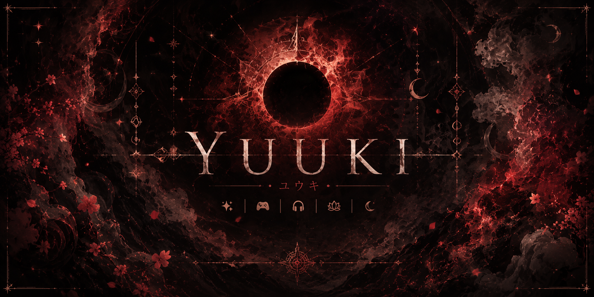

# Hii, I'm Yuuki ♡

### she/her · artist · tattoo artist · gamer · coder

I make cozy things, chaotic things, and sometimes things that are somehow both.

[My website](https://sasutendo.tech) · [Twitch](https://twitch.tv/am_sasutendo) · [TikTok](https://tiktok.com/@sasutendo) · [Instagram](https://instagram.com/sasutendo) · [YouTube](https://youtube.com/@sasutendo)

---

## 🌙 About me

I'm **Yuuki**, also known as **Sasutendo**. I'm 21 and spend a lot of my time creating, gaming, coding, drawing, and collecting far too many ideas for future projects.

I like personal projects that feel a little different: cozy interfaces, dark fantasy, playful details, Minecraft experiments, and designs that actually feel like *me*.

- 🎮 Usually playing **osu!**, Minecraft, or whatever currently has my attention
- 🎨 Into drawing, tattoo art, photo editing, and stream graphics
- 💻 Building websites, apps, Minecraft plugins, and Fabric mod experiments
- ☕ Powered by coffee, music, cats, and questionable sleep schedules
- ✦ Always interested in making something new, cute, strange, or atmospheric

## 💫 Things I'm working on

### CozyBond

A relationship-focused website and Android app with shared tracking, mini-games, badges, and other cozy features.

### Bettle

A Minecraft Fabric horror mod with custom items, creatures, unsettling mechanics, and visual experiments.

### Minecraft plugins

GUI-based plugins with quests, rewards, daily systems, economies, and other server features.

### My personal website

A small home for my socials, projects, gallery, interests, and updates—built to feel more like a personal internet corner than a normal portfolio.

## 🩷 This website

The repository lets visitors look through the project behind [sasutendo.tech](https://sasutendo.tech). The website is colorful, animated, personal, and designed for phones as well as desktop screens.

### Highlights

- Custom profile, links, badges, projects, and gallery
- Dreamy themes with adjustable colors and transparency
- Animated particles and cursor trails
- Background music with volume controls
- Changelog and visitor counter
- Responsive desktop, tablet, and phone layouts
- Lightweight vanilla HTML, CSS, and JavaScript
- Cloudflare Pages Functions and KV for shared production data

## 👀 Viewing and sharing

This repository and website are shared for **viewing and personal reference only**. They are not open source and are not provided as a template.

You may:

- View the official website
- Read the repository when access is provided
- Share unmodified links to the official website or repository

You may **not** copy, download, clone, fork, recreate, modify, redistribute, host, sell, market, advertise, or reuse the website, its code, its design, or any of its assets without my prior written permission.

Sharing a link does not give anyone permission to reuse the project.

## 📜 Rights

**© 2026 Yuuki (Sasutendo). All rights reserved.**

The complete [view-only copyright notice](./LICENSE) applies to the source code, design, layout, text, branding, images, GIFs, audio, artwork, profile content, and every other part of this project.

---

Made with ♡ by Yuuki  
and a suspicious amount of pink ✦

